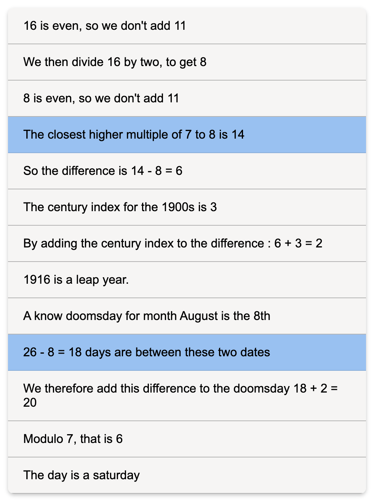

#  Doomsday algorithm trainer

Train yourself to execute Conway's doomsday algorithm with this PWA.

I'm assuming you know the [doomsday rule and the "odd +11" method](https://en.wikipedia.org/wiki/Doomsday_rule#The_%22odd_+_11%22_method).

You can access a [live demo](https://george-ober.github.io/doomsday-trainer/) that can be installed and used offline as a PWA.

## Why write another?

Many other projects hosted on GitHub offer similar functionnalities, but they do not allow the user to keep track of their progress by keeping a log of all the times they played. The data is, of course, **stored locally** in the $localStorage$, and can be **exported as a JSON** file by clicking the Download Data button.

In fact, if you are a data junkie, here is an example of an entry for a "round":

```json
{
  "date": "1916-08-26",
  "playedAt": 1720517095297,
  "expectedAnswer": 6,
  "givenAnswer": 3,
  "timeTaken": "16.67",
  "errorsMade": ["higher-multiple", "day-difference"]
}
```

- `date` corresponds to the date you were supposed to guess
- `playedAt` is the number of milliseconds between the epoch and the moment when you saw the date you were supposed to guess
- `expectedAnswer` is the expected answer (this is a redundant information since you can derive it from `date`)
- `givenAnswer` is what button you clicked
- `timeTaken` is the number of seconds it took you to solve the problem
- `errorsMade` is an array containing strings of the mistakes you reportedly made

## Logging mistakes

This is potentially the biggest missing feature in all the other alternatives given that it can make you understand what step of the Doomsday Algorithm needs more practice, here's how it works :

After answering a round, right or wrong, you are shown an interface with a line-by-line description of every step of the process that you should have done in your head.



You can then select one or multiple rows, or steps, where you remember having made a mistake.

The image above is the interface the user sees for the date `1916-08-26`, and the two selected rows are `higher-multiple` and `day-difference`

For the moment, I haven't made a data viewer, but I hope that I will.

Here is a list of all the error types and their meaning

| Key                       | Meaning                                                                | Suggested Report or Comments                                                                            |
| ------------------------- | ---------------------------------------------------------------------- | ------------------------------------------------------------------------------------------------------- |
| `first-add-11`            | Correctly added the 11 for the first time                              | If you forgot to add it when odd or if you did it when even or if you made a math mistake               |
| `divide-two`              | Correctly divided by two                                               | If you made a math mistake                                                                              |
| `second-add-11`           | Correctly added 11 for the second time                                 | If you forgot to add it when odd or if you did it when even or if you made a math mistake               |
| `higher-multiple`         | Correctly found the closest higher multiple of 7                       | If you used any other number                                                                            |
| `difference`              | Correctly subtracted the number from the higher multiple               | If you made a substraction error                                                                        |
| `century-index`           | Correctly found the century index                                      | If you don't know the 5 3 2 0 coefficients                                                              |
| `add-century`             | Correctly summed the century index to the difference                   | If you made an addition error                                                                           |
| `noleap-century-100`      | Did not identify years like 1800, 1900, 2100 as leap years             |                                                                                                         |
| `leap-century-400`        | _Did_ identify years like 2000 as leap years (400 year rule)           | <br>                                                                                                    |
| `leap-normal`             | Correctly identified a leap year for a non 00s year                    | If you didn't notice it (happens usually in higher values where you don't know if it is divisible by 4) |
| `noleap-normal`           | Did not identify a year as a leap year when it wasn't                  |                                                                                                         |
| `doomsday-month`          | Correctly used a known doomsday for the required month                 | It's okay if you didn't use the same doomsday as the one given in example                               |
| `day-difference`          | Correctly substracted the doomsday from the date                       | You shouldn't be scared of negative values if your doomsday is **after** the searched date              |
| `sum-difference-doomsday` | Correctly added the doomsday to this day difference                    | If you made an addition arror (happens sometimes with negative values)                                  |
| `final-mod`               | Correctly found the modulo value                                       | Knowinf the equivalence classes of $\mathbb{Z}/7\mathbb{Z}$ really helps.                               |
| `number-to-day`           | Correctly found the name of the day of the week associated to a number | m**on**day, **two**sday...                                                                              |

## Other doomsday projects

A big inspiration to do something was [Grantas33](https://github.com/grantas33/Doomsday-algorithm-practice)'s PWA with similar functionnalities that I've used for quite a while.
[Benjenkins95](https://benjenkinsv95.github.io/doomsday-rule-trainer/)'s project can also be mentionned, with his interactive solving idea. They both use React.

I first tried bringing this idea to life with a Linux program written with GTK4 that I could publish as a Flatpak, but then I found out it would be heavier than a React App, so I just wrote this bare HTML, CSS, and JS solution and it works.

The code is published under the GPLv3 license.
